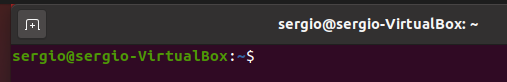

# Conceptos Básicos

!!! danger "¡Cuidado!"
	Si vas a realizar pruebas, recomendamos que lo hagas en una máquina virtual vacía en la que no arriesgues información importante.

Una de las formas con las que nos podemos comunicar con un sistema operativo es el **CLI (Command-line interface)**. La interfaz de línea de comandos es una pantalla donde el usuario se comunica con el ordenador escribiendo en la pantalla una serie de comandos que proporciona el SO. **Esta interfaz tiene como desventaja que es difícil de aprender**, ya que hay que recordar el nombre de los mandos y la sintaxis necesaria para que el ordenador los interprete correctamente.

Antes de que existiera Windows, MS-DOS, era uno de los sistemas operativos que tenían los ordenadores. Este sistema ya no está disponible pero el podemos simular en Windows. **El programa que interpreta los comandos de MS-DOS es el "Símbolo del sistema"** y se ejecuta mediante la aplicación **cmd.exe**.

La consola es una interfaz de usuario de tipo texto para interactuar con el sistema operativo. **El usuario escribe una orden en el símbolo del sistema o prompt que se ejecuta al pulsar la tecla Intro**. Un programa, llamado **intérprete de comandos** o **shell**, comprueba si la sintaxis es correcta y **ejecuta** el mando. Cuando finaliza vuelve a mostrar el prompt y podemos escribir otra orden.

El **prompt** es un símbolo que muestra el sistema operativo y que indica que está preparado para recibir órdenes. Además, muestra información al usuario como el directorio actual o el nombre del usuario y el ordenador en el caso de Linux

En Windows el prompt es el símbolo “>” y muestra el directorio actual: C:\Users\Sergio, es decir, el directorio personal del usuario Sergio.

**En Linux el prompt** de cualquier usuario (excepto **root**) es **$** y la información que muestra es el usuario (**sergio**), el nombre del ordenador (**sergio-virtualbox**) y el directorio actual (~, **virgulilla** (ALT GR + 4), que es el directorio personal del usuario, es decir, **/home/sergio**). El símbolo **@** separa el usuario y el ordenador y el símbolo: separa el ordenador del directorio actual

`root@sergio-VitualBox:/home/sergio#`

El Linux **el prompt de root es #**. La información mostrada es el usuario (**root**), el ordenador (**sergio-virtualbox**) y el directorio actual (/home/sergio, es el mismo que antes pero en este caso ese directorio no es el directorio personal de root por lo que no pone ~).

**El directorio actual es el directorio en el que nos encontramos en este instante y en el que se ejecutará la orden**. Si, por ejemplo, el orden es de crear el directorio "**prueba**" (mkdir prueba) ese directorio se creará en el directorio actual. En los ejemplos anteriores se creará dentro de **/home/sergio** (en los ejemplos de Linux) y dentro de **C:\Users\sergio** (en el ejemplo de Windows).

